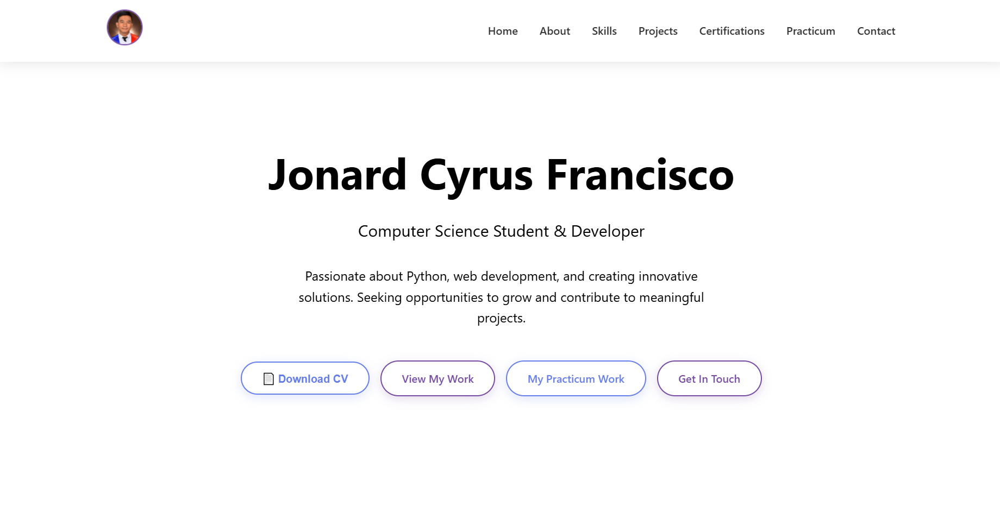

# 🌐 Jonard Cyrus Francisco - Portfolio Website

[](https://jonard-francisco.vercel.app)
[](https://github.com/Jonard14/MyWebsitePortfolio/commits/main)

 

## 🚀 Features

- **Modern Responsive Design**: Works on all devices
- **Project Showcase**: Highlight my work
- **Contact Form**: With email integration
- **Performance Optimized**: Fast loading with lazy loading

## 🛠 Technologies Used

- **Frontend**: HTML5, CSS3, JavaScript
- **Hosting**: Vercel
- **Email Service**: Nodemailer (via API route)
- **Tools**: Git, VS Code

## 🖥️ Live Demo

Visit the live website:  
[https://jonard-francisco.vercel.app](https://jonard-francisco.vercel.app)

## 📂 Project Structure
```text
MyWebsitePortfolio/
├── api/
│   └── sendEmail.js       # Handles contact form submissions (Nodemailer)
├── css/                   # All stylesheets
│   ├── base.css           # Global styles and variables
│   ├── components.css     # Reusable UI components
│   ├── dropdown.css       # Dropdown-specific styles
│   ├── layout.css         # Page structure and grid system
│   └── sections.css       # Individual page section styling
├── js/
│   ├── components.js      # Custom web components (<site-nav>)
│   ├── dropdown.js        # Dropdown interactivity
│   ├── form.js            # Contact form validation and submission
│   └── main.js            # Core application logic
├── img/
│   └── projects/          # Project screenshots and logos
├── files/                 # Static files for download (e.g., resume PDF)
├── node_modules/          # Dependencies (auto-generated)
│
├── index.html             # Homepage
├── projects.html          # Project showcase
├── certifications.html    # Certifications display
├── practicum.html         # Practicum Report
├── contact.html           # Contact page
│
├── vercel.json            # Deployment configuration
├── package.json           # Project metadata and dependencies
├── package-lock.json      # Exact dependency versions (auto-generated)
└── README.md              # Project documentation
```